# 📱 App de Autenticação com React Native (Expo)

Este é um aplicativo de autenticação simples feito com **React Native** usando **Expo**, que permite:

- Registro de usuários com **e-mail**, **telefone** (com máscara brasileira) e **senha**.
- Login com e-mail e senha.
- Recuperação de senha com base no e-mail e telefone.
- Armazenamento local usando **AsyncStorage**.
- Criptografia de senhas com **SHA-256** via `crypto-js`.
- Validações de entrada (e-mail, senha forte, confirmação de senha e DDD brasileiro).
- Cadastrar Paciente, Veterinário, Agendar Consulta e Realizar Consulta.

- Link do Projeto no Expo Go: [projeto](https://snack.expo.dev/@ailatan/pet-care)

---
## 🚀 Tecnologias Utilizadas

- [React Native](https://reactnative.dev/)
- [Expo](https://expo.dev/)
- [React Navigation](https://reactnavigation.org/)
- [AsyncStorage](https://react-native-async-storage.github.io/async-storage/)
- [crypto-js](https://www.npmjs.com/package/crypto-js)

---
## 🚀 Funcionalidade de Persistência dos dados

### Carregamento inicial dos dados salvos
Logo quando o componente é montado (useEffect), ele tenta carregar os dados salvos anteriormente:
```useEffect(() => {
  const carregarPacientes = async () => {
    const data = await AsyncStorage.getItem('pacientes');
    if (data) setPacientes(JSON.parse(data));
  };
  carregarPacientes();
}, []);
```
- AsyncStorage.getItem('pacientes'): busca os dados salvos sob a chave 'pacientes'.

- Se encontrar algo, ele converte de volta de JSON para objeto JavaScript e atualiza o estado com setPacientes.

### Salvando dados ao cadastrar um paciente
Quando o usuário preenche o formulário e clica em "Cadastrar Paciente", a função handleCadastro é chamada:
```const handleCadastro = async () => {
  if (!nome || !raca || !sexo || !idade || !pelagem || !nomeTutor || !endereco) {
    Alert.alert('Erro', 'Preencha todos os campos!');
    return;
  }

  const novoPaciente = { nome, raca, sexo, idade, pelagem, nomeTutor, endereco };
  const listaAtualizada = [...pacientes, novoPaciente];

  setPacientes(listaAtualizada);
  await salvarPacientes(listaAtualizada);
```

- Cria um objeto novoPaciente com os dados do formulário.

- Cria uma nova lista com os pacientes antigos + o novo.

- Atualiza o estado local (setPacientes) e também salva essa lista no armazenamento com AsyncStorage.setItem por meio da função salvarPacientes:

 ``` const salvarPacientes = useCallback(
  async (listaAtualizada) => {
    await AsyncStorage.setItem('pacientes', JSON.stringify(listaAtualizada));
  },
  []
);
```
⚠️ É necessário serializar com JSON.stringify() porque AsyncStorage só salva strings.

### Limpando os dados salvos
Quando o usuário clica em "Limpar todos os pacientes", esta função é executada:
```const handleLimparPacientes = () => {
  Alert.alert(
    'Confirmar exclusão',
    'Deseja realmente apagar todos os pacientes e consultas?',
    [
      { text: 'Cancelar', style: 'cancel' },
      {
        text: 'Sim, apagar',
        onPress: async () => {
          await AsyncStorage.removeItem('pacientes');
          await AsyncStorage.removeItem('consultas');
          setPacientes([]);
          Alert.alert('Lista zerada', 'Todos os pacientes e consultas foram apagados.');
        },
      },
    ]
  );
};
```
- Remove as chaves 'pacientes' e 'consultas' de forma permanente.

- Limpa a lista de pacientes em memória (setPacientes([])).

### Ciclo da Persistência
| Ação                      | Função usada                | Local afetado         |
| ------------------------- | --------------------------- | --------------------- |
| Carregar dados salvos     | `AsyncStorage.getItem()`    | Estado inicial do app |
| Salvar novo paciente      | `AsyncStorage.setItem()`    | Armazenamento local   |
| Apagar todos os pacientes | `AsyncStorage.removeItem()` | Armazenamento local   |

---

## 📸 Capturas de Tela

**Android** | **IOS** | **WEB** | **Usuário Logado***
:--:|:--:|:--:|:--:
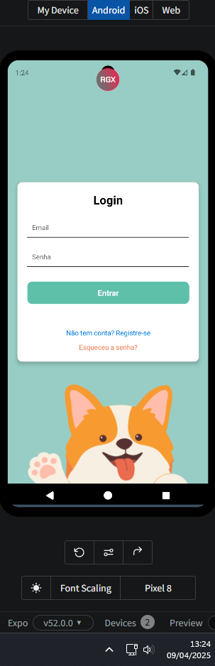 | 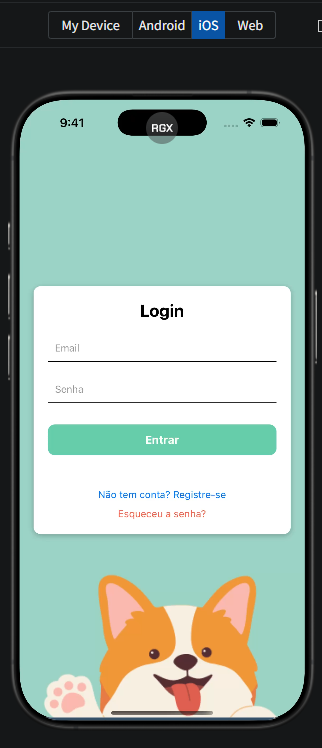 | 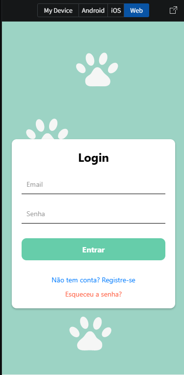 | 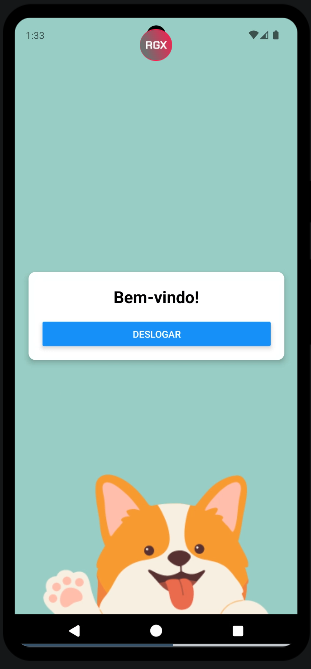

**DDD inválido** | **Recuperar Senha** | **Email ou Senha Incorretos** | **Telefone Incorreto***
:--:|:--:|:--:|:--:
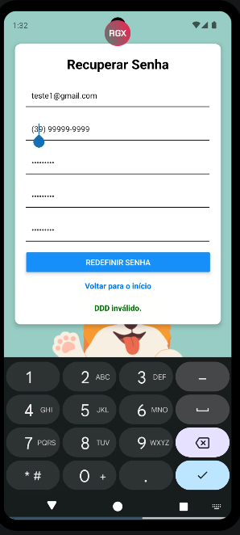 | 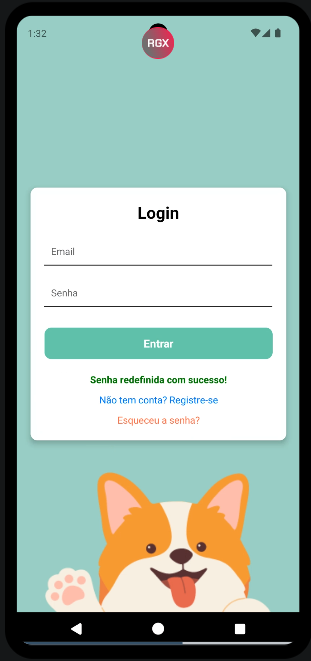 | 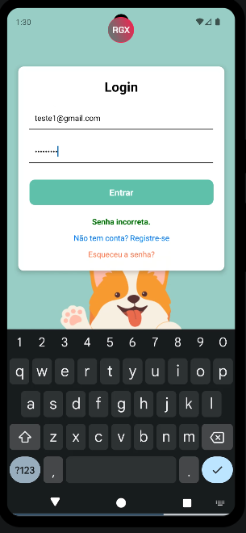 | 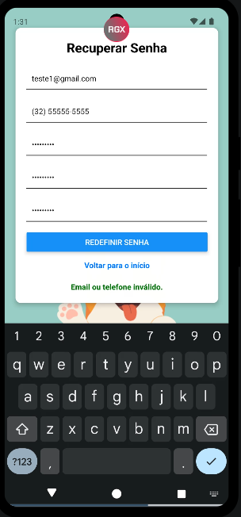

**Registro com Sucesso** | **Senhas não Coincidem** | **Senha Fora do Padrão** | **Email fora do Padrão***
:--:|:--:|:--:|:--:
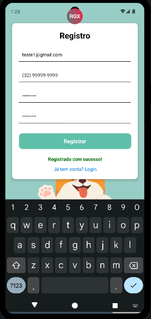 | 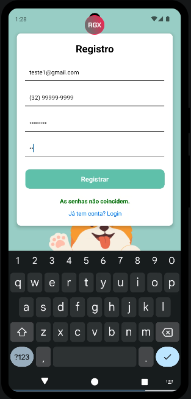 | 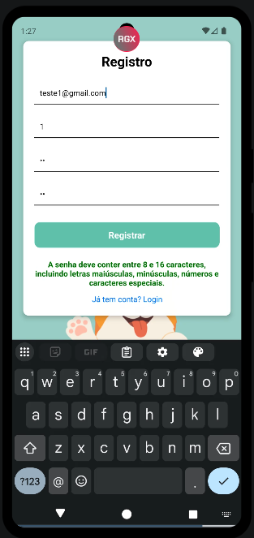 | 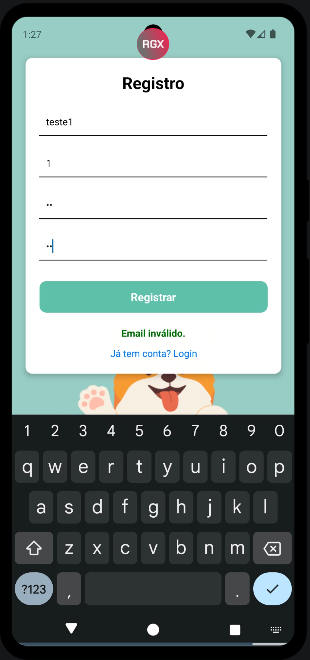

**Campos Obrigatórios** | **Usuário Não Encontrado** | **Senha Criptografada**
:--:|:--:|:--:
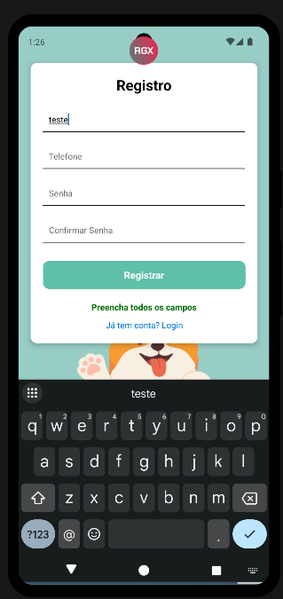 | 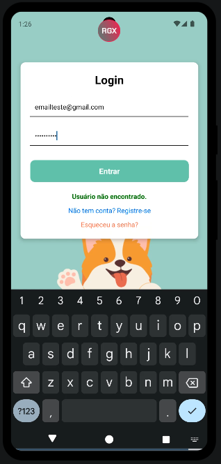 | 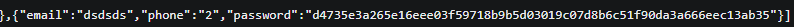 
---

## 🛠 Instalação

### 1. Pré-requisitos
- Node.js
- Expo CLI (`npm install -g expo-cli`)
- Dispositivo físico ou emulador Android/iOS
- Editor de código (VS Code recomendado)

### 2. Instale as dependências
```bash
npm install
```

---

## 🚀 Integrantes do Projeto

- Júlia Vitória
- Natália Beatriz Malta Bernini

Centro Unversitário Presidente Antônio Carlos - Barbacena

Disciplina: Programação Para Dispositivos Móveis

Orientador: Rodrigo Fernandes dos Santos

---

